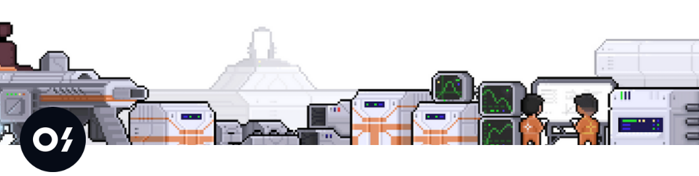

# Oslash-backend-clone

This is a simple clone of <a href="https://www.oslash.com/">oslash</a>. Making this made me realise importance of backend structuring and eventually after solving errors by Typescript, i made a MVP. 

## Features
- Login/ Logout
- Create shortlinks
- Search / delete
- analytics

## How to setup project?

clone this repo and in the root folder, 
Create a config file as follow.

<pre>
export default {
  port: XXXX,
  dbUri:
    "mongodb+srv://....true&w=majority",
  hash: "------",
  jwt: "---",
  corsOrigin: "http://localhost:3000",
};
</pre>

<code>yarn install</code>

<code>yarn dev</code>

## packages used
- cryptojs
- jsonwebtoken

## project structure
Project follows MVC framework. <code>app.ts</code> is the entry point of our project. All models are stored in models directory and same goes for controllers and middlewares.

## endpoints available
<code>GET /o/:id</code> : redirects after geting full link from short link

 <code>POST /api/auth/login</code>: logins user based on user credentials

 <code>POST /api/auth/register</code>: Reigster new user

 <code>POST /api/auth/token</code>: provide access token using refresh token

 <code>DELETE /api/auth/logout</code>: revokes access from refreshtoken

  <code>POST /api/user/create</code>: creates new short url for user
  
<code>GET /api/user/links</code>: provides all user links with additional sorting based on <code>shortlink</code> or <code>create_at</code> property

 <code>DELETE /api/user/:short</code>: deletes a link 

 <code>GET /api/user/search</code>: search user based on <code>shortUrl</code> or <code>tag</code>

 <code>GET /api/performance</code> provide URL stats of individual user [under progress]